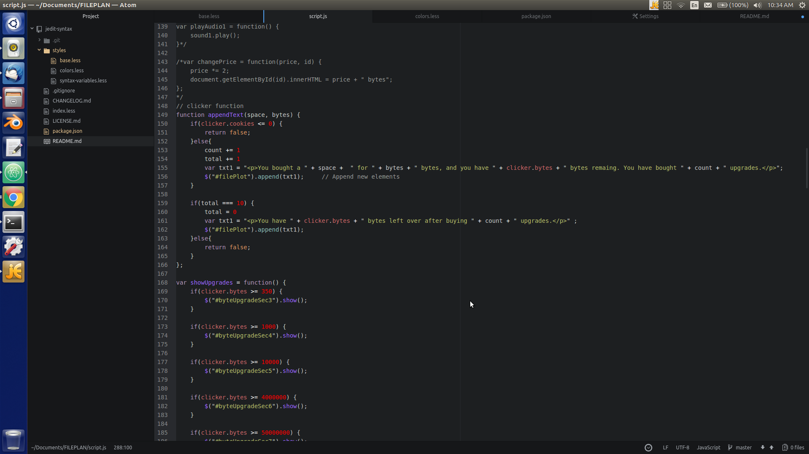

# jedit-syntax theme

This theme is based(very loosely) on [Jedit's](http://www.jedit.org/) syntax theme.

Here are some of the differences:
* Jedit's background-color was white
* The line numbers were different
* The strings were different

